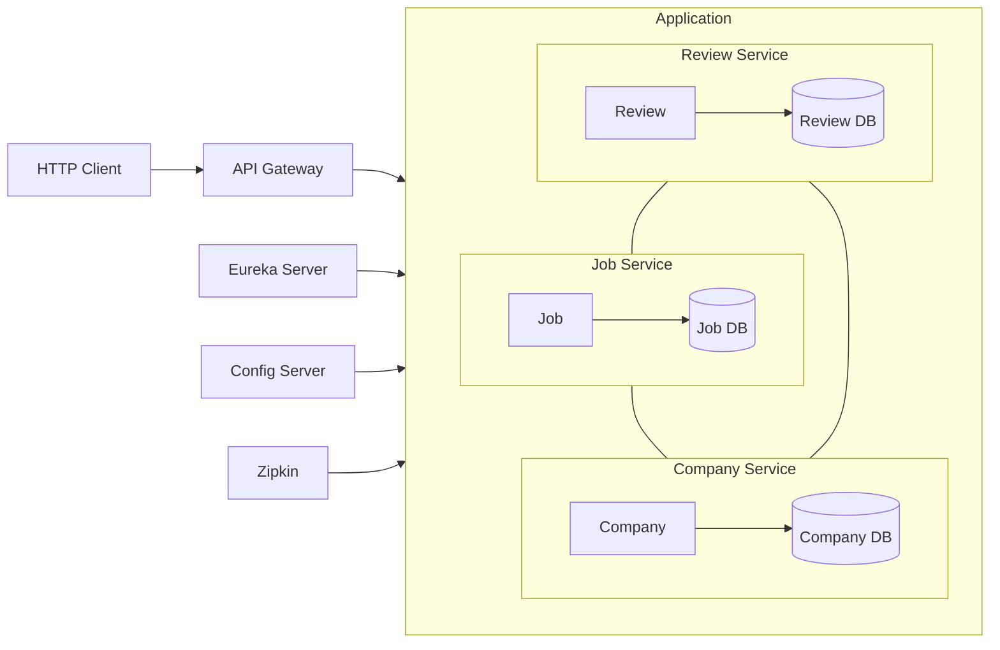

# JobAppApiMicroServices

This app converts a monolithic REST API (https://github.com/aty5/jobappapi) into microservices.

**Technical environment** :
* Docker Engine + Docker Compose (Docker Desktop)
* JDK17 / Maven / Tomcat
* Spring Boot / Spring Data JPA / PostgreSQL
* HTTP Client
* Git

## Architecture
