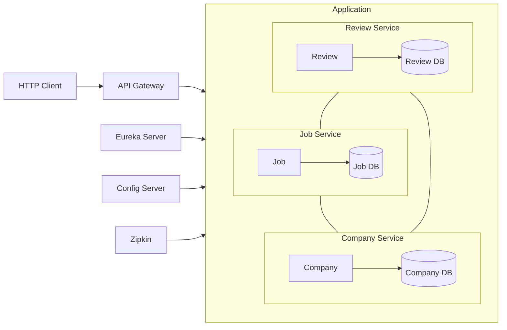

# JobAppApiMicroservices

**Project objectives** :
* Convert a monolithic REST API (https://github.com/aty5/jobappapi) into microservices architecture
* Use it as a basis for learning new skills in microservices environments

**Environment** :
* Docker Engine + Docker Compose (Docker Desktop)
* JDK17 / Maven / Tomcat
* Spring Boot / Spring Data JPA / PostgreSQL
* HTTP Client (Postman,...)
* Git

## Architecture
